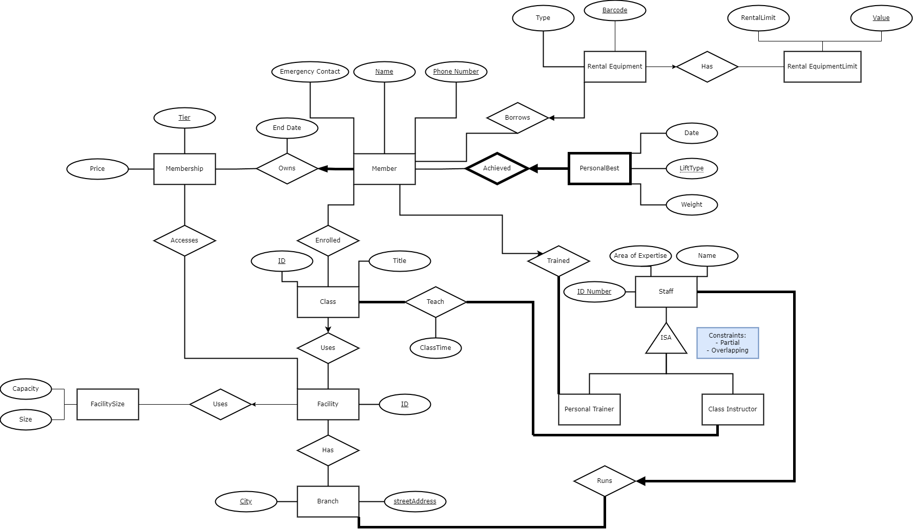

# Silver's Gym

Welcome to Silver's Gym. We make YOUR fitness OUR priority.

✨Click [here](https://www.students.cs.ubc.ca/~amluna/insert.php) to view the first page of our GUI!✨

## Files With Queries:
- [insert.php](https://github.students.cs.ubc.ca/CPSC304-2022W-T1/project_e0u4g_s7w2b_y5t2b/blob/master/src/insert.php)
- [update.php](https://github.students.cs.ubc.ca/CPSC304-2022W-T1/project_e0u4g_s7w2b_y5t2b/blob/master/src/update.php)
- [delete.php](https://github.students.cs.ubc.ca/CPSC304-2022W-T1/project_e0u4g_s7w2b_y5t2b/blob/master/src/delete.php)
- [select.php](https://github.students.cs.ubc.ca/CPSC304-2022W-T1/project_e0u4g_s7w2b_y5t2b/blob/master/src/select.php)
- [project.php](https://github.students.cs.ubc.ca/CPSC304-2022W-T1/project_e0u4g_s7w2b_y5t2b/blob/master/src/project.php)
- [join.php](https://github.students.cs.ubc.ca/CPSC304-2022W-T1/project_e0u4g_s7w2b_y5t2b/blob/master/src/join.php)
- [aggregationWithGroupBy.php](https://github.students.cs.ubc.ca/CPSC304-2022W-T1/project_e0u4g_s7w2b_y5t2b/blob/master/src/aggregationWithGroupBy.php)
- [aggregationWithHaving.php](https://github.students.cs.ubc.ca/CPSC304-2022W-T1/project_e0u4g_s7w2b_y5t2b/blob/master/src/aggregationWithHaving.php)
- [nestedAggregation.php](https://github.students.cs.ubc.ca/CPSC304-2022W-T1/project_e0u4g_s7w2b_y5t2b/blob/master/src/nestedAggregation.php)
- [division.php](https://github.students.cs.ubc.ca/CPSC304-2022W-T1/project_e0u4g_s7w2b_y5t2b/blob/master/src/division.php)

## SQL data resources can be found in:
[final.sql](https://github.students.cs.ubc.ca/CPSC304-2022W-T1/project_e0u4g_s7w2b_y5t2b/blob/master/resources/final.sql)

## ER Diagram

